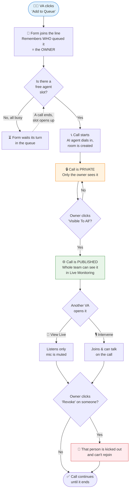

# Call Queue & "Publish a Call" — How It Works, End to End

A plain-language guide to how a verification call goes from **"a VA adds it to the queue"**
all the way to **"other VAs can watch or jump in"** — and how the two pieces of code
(the **queue dispatcher** and **PR #48: publish & intervene**) fit together.

> **The one idea to remember:** PR #48 does **not** change *how* calls get scheduled.
> The queue works exactly as before. PR #48 just adds an **ownership + sharing** layer
> on top: it answers *"who owns this call, and who else is allowed to watch or talk on it?"*

---

## The simple story

1. **A VA clicks "Add to Queue."** The system remembers **who did it** — that person is the **owner**.
2. **The queue finds a free agent slot** (there's a limit on how many calls can run at once per team).
3. **The call starts** — the AI agent dials in and a call "room" is created. It's **private** by default (only the owner sees it).
4. **The owner can click "Visible To All"** to **publish** the call, so the whole team can see it in Live Monitoring.
5. **Other VAs can then either watch (mic muted) or intervene (join and talk).**
6. **The owner can revoke** anyone — they get kicked out and can't rejoin.

---

## Flow chart



### Plain-text version (if the diagram doesn't render)

```
  ┌─────────────────────────────────────────────────────────┐
  │  1. A VA clicks "Add to Queue"                            │
  │     → The system remembers WHO did it = the OWNER         │
  └─────────────────────────────┬───────────────────────────┘
                                 ▼
                    ┌────────────────────────┐
                    │  Is an agent slot free? │
                    └───────┬────────┬───────┘
                    NO      │        │      YES
              ┌─────────────┘        └─────────────┐
              ▼                                     ▼
   ┌──────────────────────┐            ┌────────────────────────┐
   │ Wait in the queue    │            │ 2. Call STARTS          │
   │ (a call ends →       │──── slot ─▶│    AI agent dials in,    │
   │  slot frees → retry) │   opens up │    room is created       │
   └──────────────────────┘            └───────────┬────────────┘
                                                    ▼
                                     ┌────────────────────────────┐
                                     │ 3. Call is PRIVATE          │
                                     │    (only the owner sees it) │
                                     └───────────┬────────────────┘
                                                 ▼
                              Owner clicks "Visible To All"?
                                     │                 │
                                    NO                YES
                                     │                 ▼
                            stays private   ┌──────────────────────────┐
                                            │ 4. Call is PUBLISHED       │
                                            │    Whole team can see it   │
                                            └───────────┬──────────────┘
                                                        ▼
                                       Another VA opens the call:
                                        │                        │
                                  👀 "View Live"           🎙️ "Intervene"
                                  listen only,             joins and
                                  mic muted                can talk
                                        │                        │
                                        └───────────┬───────────┘
                                                    ▼
                                   Owner can "Revoke" anyone →
                                   they're kicked out & can't rejoin
                                                    ▼
                                        ✅ Call runs until it ends
```

---

## A little more detail (for the technical folks)

The whole feature hangs on **two fields**:

| Field | Set when… | Purpose |
|-------|-----------|---------|
| `patient_form.enqueued_by_id` | a VA moves a form to **In Queue** | remembers who queued it |
| `call.initiated_by_id` | the dispatcher actually starts the call | copies that person over as the **owner** |

**Why two fields instead of one?** Because the call might start *right away*, or *minutes
later* when a slot frees up, or *on a retry*. By carrying the owner on the **form** first and
copying it onto the **call** when it's created, the right person stays the owner no matter
how late the call actually starts.

### How the queue schedules (unchanged by PR #48)

- Enqueue fires the dispatcher; a call ending also fires the dispatcher (a slot just freed).
- This is **event-driven** — no external message broker (Kafka/SQS) needed.
- The dispatcher counts active calls, computes free slots (`max_agents_per_va - active`),
  and pulls the oldest waiting forms first (FIFO), using a per-tenant lock so two runs can't
  both grab the same free slots.

### What PR #48 adds (all keyed off the owner field)

- **See a call** (`GET /calls`): you see *your own* calls + any *published* call.
- **Publish** (`POST /calls/{id}/publish`): owner-only, one-way (can't un-publish).
- **Join** (`GET /calls/{id}/join-token`): *View Live* = mic muted; *Intervene* = can talk.
  A private call you don't own returns "not found" (so call IDs can't be probed).
- **Revoke** (`POST /calls/{id}/revoke-access`): owner kicks someone out; they can't rejoin.
- Every publish / join / revoke is written to the **audit log** (IDs only, no patient data).

---

## One-sentence summary

> The dispatcher creates calls and stamps each one with its queuer as the **owner**
> (`enqueued_by_id` → `initiated_by_id`); PR #48 uses that owner field to decide who can
> **see, publish, watch, talk on, or be removed from** each live call — without changing how
> the queue schedules work.
