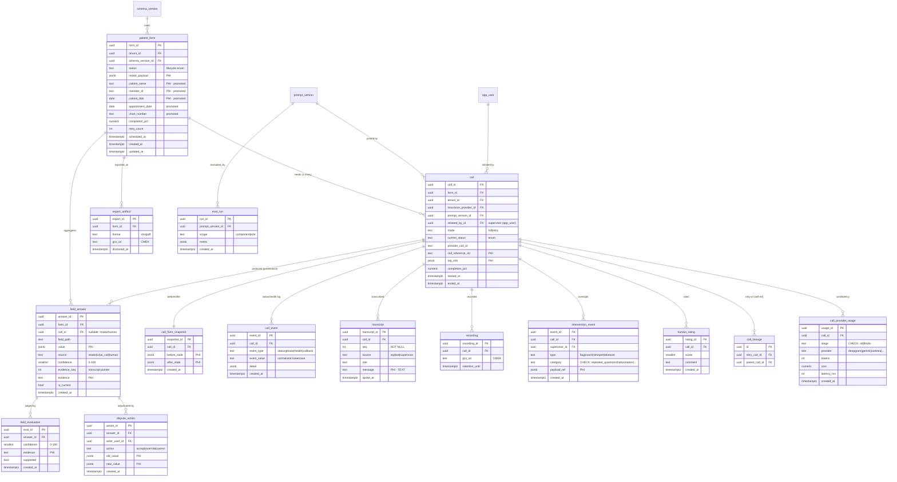

# Vera 2.0 — Reconciled Database Design & ERD

**Date:** 2026-06-14
**Status:** Draft for review
**Supersedes for v2:** the redesign half of `database-redesign-proposal.md` (the v1 audit in that file still stands as the evidence base)

## Inputs reconciled here

1. **Vera 2.0 Technical Specification v1.0 (08 Jun 2026)** — §5 Data Model (Fig 7 tenant/config/authoring, Fig 8 call/verification/oversight), §6 Database Design, §7 API Contracts, §8 Prompt Engineering, §9 HIPAA mapping.
2. **The v1 production audit** (`database-redesign-proposal.md`) — evidence-backed pain points from the live `smart-caller` database.

The spec ships its own ERD. Per the brief, I did **not** adopt it verbatim — each entity was judged (Adopt / Adapt / Reject), and where the spec conflicts with what the v1 production data proved, I chose the design that the evidence supports and say why.

## Two decisions locked for this draft

- **Form-data model: `field_answer` (request-level, call-provenanced, `is_current` flag).** Chosen over the spec's `form_instance`-per-call. Rationale and the multi-retry walkthrough are in §4.
- **PHI at rest: plaintext under CMEK now; application-layer encryption + blind indexes reserved and designed-for, retrofitted after compliance sign-off.** Rationale and the make-it-cheap-later rules are in §5.

---

## 1. Verdict on the spec's ERD (entity by entity)

| Spec entity | Verdict | Rationale |
|---|---|---|
| `tenant` | **Adopt + extend** | Clean multi-tenant root; holds the runtime knobs (max_agents_per_va, retry_fill_threshold, persona_tweak). Better than v1, which had no tenant-level config home. Extended with `gcip_tenant_id` for the GCIP auth model — see §3.5. |
| `api_key` (salted-hash only, scoped, expiry) | **Adopt** | The correct home for **inbound** keys (external systems authenticating *to* Vera): Vera only verifies them, so hash-only + scope + expiry. v1 wrongly modeled these as an "API Key" integration type stored plaintext (`integrations.py:89`). See §2. |
| `tenant_credential` (secret_ref, rotated_at) | **Reject → replace** | Subsumed by a hardened `integration_type` + `integration` pair carried over from v1. The spec's flat `tenant_credential` loses v1's typed catalog + `credentials_schema` (validation, dynamic form, test-before-save). See §2. |
| `integration_type` + `integration` *(from v1)* | **Adopt + harden** | **Outbound** credentials (Vera presents to Twilio/EMR — must be recoverable). Keep v1's catalog structure; swap plaintext `credentials` JSON → `secret_ref` (Secret Manager) + `rotated_at`. Tenant-owned; **no** `insurance_provider_id` scoping. |
| `user` | **Adapt** | Rename to `app_user` (avoid the reserved-word friction v1 lived with); keep tenant-scoped. The inline `role` CHECK enum is **removed** in favour of full RBAC (`role`/`permission`/`user_role`); `gcip_uid`/`status`/`last_login_at` added. Full auth/authz model in §3.5. |
| `insurance_provider` (global, working hours) | **Adopt** | Master data with working-hours gate. Matches v1 intent; now global with proper status. |
| `ivr_playbook` (FK provider) | **Adopt** | Real FK to provider — fixes v1's `prompts.insurance_provider_name` string-match anti-pattern (P8). |
| `form_schema` → `schema_version` | **Adopt (strongly)** | Versioned schema catalog is exactly v1 P3's missing piece (no form-schema versioning). The version chain is the spec's best contribution. |
| `prompt` → `prompt_version` (tagged to `schema_version`) | **Adopt** | Prompt generated from a published schema version, versioned as a unit. Enables call→prompt→schema traceability v1 entirely lacked. |
| `audit_log` (WORM, hash chain) | **Adopt** | v1 had no audit log at all. Append-only + per-row hash chain is the HIPAA baseline. |
| `patient_form` (intake) | **Adapt** | Keep as aggregate root, but **promote searchable identifiers out of `intake_payload`** into typed columns (v1 improvement — see §3). Spec's all-in-JSON reproduces v1's "ILIKE on JSON = seqscan" problem. |
| `call` (mode, started/ended) | **Adapt** | Add `current_status` enum + pin `prompt_version_id`. Add a `call_event` append log for status/phase/health (the spec shows no call-status mechanism; v1 P2 proved you need one that isn't a dead pointer). |
| `form_instance` (1—1 with call) | **Reject (as the value store)** | This is the spec's central modeling choice and the one I'm overturning. Per-call instances force an N-instance merge to render the current form — the exact v1 pain (P1) relocated, and it degrades non-linearly past 2 retries. Replaced by `field_answer`. The legitimate *snapshot* need it served is kept as `call_form_snapshot` (§4). |
| `form_field_value` (per instance, before/after flag) | **Reject → replace** | Becomes `field_answer` rows keyed to the *form* with call provenance + `is_current`. |
| `field_evaluation` (confidence, evidence span) | **Adapt** | Keep as a **separate** post-call judge verdict (the spec's two-pass design — realtime fill vs LLM-as-judge, §8.6/§8.7 — is genuinely good; disagreement = dispute signal). Re-point its FK at `field_answer`. |
| `dispute_action` (old/new, audited) | **Adapt** | Keep; a resolution emits a new `field_answer` with `source = human` instead of mutating in place. |
| `recording` (gcs_uri CMEK, retention_until) | **Adopt** | Matches §6.2 retention/crypto-shred. |
| `transcript` (seq **NULLABLE**, message) | **Reject the nullable seq + bounded message** | The spec ERD literally reproduces v1 P5: `seq NULLABLE` and an implied length cap. Make `seq NOT NULL`, add `UNIQUE(call_id, seq)`, and store `message` as `TEXT`. This is a case where the spec inherited the bug. |
| `call_lineage` (retry→parent self-ref) | **Adopt** | Good for tracing retry descent. Note: it complements `field_answer.is_current` (the merge mechanism) rather than being relied on for the merge. |
| `intervention_event` (type, payload_ref) | **Adopt + extend** | Coaching/whisper/takeover audit trail per §4.6.2. Added a first-class `category` CHECK-enum (repeated_questions/hallucination/conversation_loop/…) so the intervention-by-category report is `GROUP BY category`, not a JSON scan — see §6. |
| `export_artifact` (disclosed_at) | **Adopt** | Disclosure logging for PHI leaving the perimeter (§4.5.4). |
| `eval_run`, `human_rating` | **Adopt** | Evals harness + human rater feedback (§4.7.1). |
| *(provider cost/latency telemetry)* | **Add (new)** | Not in the spec ERD or v1. Added `call_provider_usage` so the spec's §4.7.2 cost-distribution and latency-per-STT/LLM/TTS reports have a home — see §6. |
| *(schema fields exploded into relational rows)* | **Reject my own v1 idea** | v1 proposed `form_template_fields` so the DB owns field definitions. In the spec's architecture, field definitions live in the versioned `schema_json` DSL and the composite prompt is **generated** from it — one source, compiled. That achieves the same "no nine-file drift" goal more cleanly here, so I drop the exploded-field tables. |

---

## 2. Conflicts between the spec and the v1 audit — and the call I made

| Topic | Spec says | v1 audit / production data says | **Decision** |
|---|---|---|---|
| Form value storage | `form_instance` per call; merge across instances via `call_lineage` | One append-log per form was the #1 pain; "current value" re-derived in Python on every read; same field seen up to 5× in live data | **`field_answer` keyed to form, with `call_id` + `is_current`.** DB owns the aggregate; per-call view is a filter, not a structure. |
| Per-call before/after | `form_field_value.snapshot (before/after)` flag | Snapshot need is real (call-level isolation) but the flag bloats every value row | **`call_form_snapshot`** table: one frozen `before`/`after` JSONB per call. Satisfies the spec's isolation/snapshot requirement; `field_answer` stays the queryable truth. |
| Searchable patient fields | Everything inside `intake_payload` (PHI jsonb) | v1: `primary_values ->> 'patient_name'` ILIKE = full seqscan; only the PK was indexed | **Promote** patient_name, member_id, dob, appointment_date, chart_number to typed indexed columns; keep the rest in `intake_payload`. |
| Transcript ordering | `seq NULLABLE` | 4,174/8,192 live rows had NULL seq; 197 *after* the migration — three writers never set it | **`seq NOT NULL` + `UNIQUE(call_id, seq)`**, `message TEXT`. Fail loud at insert, no truncation. |
| Call status | (not modeled) | v1 `call_status_id` was a dead pointer (NULL in 430/430); status derived by window-scan; free-text casing (`completed` vs `Completed`) | **`call.current_status` enum maintained transactionally + `call_event` append log** with normalized lowercase values. |
| Multi-tenancy | `tenant_id` on every tenant table + RLS | v1 had no `organization_id` on `patient_forms`; scoping rode on a remembered join | **Adopt the spec** — `tenant_id NOT NULL` everywhere + RLS. The spec is better here; v1 loses. |
| Schema/prompt versioning | full version chain | v1 had none; in-place schema mutation orphaned in-flight forms | **Adopt the spec** — the version chain is the headline win. |
| Credentials | spec splits inbound (`api_key`) vs outbound (`tenant_credential`); both hardened | v1 conflated both in one plaintext `integrations.credentials` blob, but had a *better-structured* outbound catalog (`integration_type` + `credentials_schema`) | **Split by direction (see below).** Spec's `api_key` for inbound; v1's hardened `integration_type`/`integration` for outbound; drop `tenant_credential`. |
| Keys | UUID public identifiers | v1 used bare `int` PKs (enumerable across tenants) | **Adopt UUID PKs** for all resources (no sequential-ID tenant enumeration). |

Net: the spec **wins** on tenancy, versioning, audit, and key opacity (all v1 weaknesses). The v1 evidence **wins** on the form-value model, searchable-field promotion, transcript integrity, and the outbound-credential catalog. The design below takes both.

### 2.1 Credentials: split by direction, not by source

The current code stores two opposite kinds of secret in one plaintext `integrations.credentials` JSON — a defect deeper than the plaintext itself:

- **Inbound** (the seeded "API Key" type, `integrations.py:89` → `{"api_key": token_hex(16)}`) — a key Vera *issues* for an external system to authenticate *to* Vera. Vera only ever **verifies** it ⇒ store a **salted hash** (irreversible) + scope + expiry + revoke. This is the spec's **`api_key`** table; pull it out of the integration tables entirely.
- **Outbound** (the seeded "Twilio" type — `account_sid`/`auth_token`, read back in plaintext at `twilio.py:41`) — a secret Vera *presents* to a third party. Vera must **recover** it ⇒ store a **`secret_ref`** to Secret Manager (recoverable) + `rotated_at`.

You cannot merge these — one must be irreversible, the other reversible. So the right axis is **direction**, and each source got one side right: the spec correctly separated inbound from outbound, while v1 had the richer outbound catalog (`integration_type.credentials_schema` drives validation, the dynamic UI form, and `validate_credentials`/`test_twilio_credentials` test-before-save) but a broken security model.

**Decision:** keep the spec's `api_key` for inbound; keep v1's `integration_type` + `integration` for outbound, hardened by replacing the plaintext `credentials` JSON with `secret_ref` + `rotated_at`; **drop the spec's flat `tenant_credential`** (subsumed, less structure). `integration` is **tenant-owned only** — no `insurance_provider_id` scoping. A `UNIQUE(tenant_id, integration_type_id)` matches today's "one integration per type per tenant" behaviour (`integrations_types.py` `get_all_integration_types`). Migration: existing "API Key" rows are **re-issued** into `api_key` (a hash can't be derived from a value you no longer hold in the clear); Twilio rows migrate by moving each blob into Secret Manager and storing the returned `secret_ref`.

#### 2.1.1 How outbound secrets live in Secret Manager

The layering: `integration.secret_ref` (in Cloud SQL) → a **Google Cloud Secret Manager** secret → whose payload is encrypted at rest by **Cloud KMS (CMEK)**. The database holds only the reference, never the credential — not even encrypted.

- **GCP components.** *Secret Manager* is the credential vault (spec §2.1, §3.1.1). *Cloud KMS (CMEK)* is the customer-managed key encrypting the secret payload (so secrets share the same key-control/rotation posture as Cloud SQL and GCS). *Cloud SQL* stores `secret_ref` only.
- **`secret_ref` shape.** The Secret Manager resource name, not the value:
  `projects/{project}/secrets/{secret_id}/versions/{version}`. One secret **per integration row**; convention `secret_id = tnt-{tenant_id}-int-{integration_id}` for tenant isolation and audit. The payload is the full credential JSON (Twilio = `account_sid` + `auth_token` + `outbound_phone_number` in one version), so `credentials_schema` validation stays meaningful.
- **Write path** (tenant saves Twilio): validate against `credentials_schema` → `test_twilio_credentials` (test-before-save, kept from v1) → `CreateSecret` (first time, with the CMEK key) + `AddSecretVersion(payload=json)` → write the `integration` row with `secret_ref` + `rotated_at = now()`. Plaintext never touches the table.
- **Read path** (runtime needs creds, replacing today's `integration.credentials["account_sid"]` at `twilio.py:41`): load row → `secret_ref` → `AccessSecretVersion(secret_ref)` → parse JSON → `Client(...)`. Held in process memory for the call only; never persisted back.
- **⚠ Build-time caveat — access cost.** Secret Manager has a per-access latency and quota cost, so the runtime must fetch a tenant's outbound creds **once per call** (or cache briefly in-process with a short TTL), **not on every API hop**. Fine for this workload: a call resolves Twilio creds once at dispatch. Avoid a naïve "fetch on every Twilio API helper invocation" pattern.
- **Versioning / rotation.** Default `secret_ref` to `/versions/latest`: rotation = `AddSecretVersion`, next read picks it up, `rotated_at` records when. (Pin `/versions/N` instead only if a credential must be deterministically auditable per use — costs a row update per rotation.)
- **IAM isolation (the payoff over plaintext-in-DB).** The runtime service account holds `roles/secretmanager.secretAccessor`, ideally granted **per-secret / per-tenant**. A DB dump or leaked DB credential yields only `secret_ref` strings — useless without separate Secret Manager IAM, and every `AccessSecretVersion` is independently logged. Credential access becomes a second, separately-audited authorization decoupled from database access.

---

## 3. Reconciled v2 ERD

### Domain A — Tenant, configuration & authoring

```mermaid
erDiagram
    tenant ||--o{ app_user : has
    tenant ||--o{ api_key : "issues (inbound)"
    tenant ||--o{ integration : "holds (outbound)"
    tenant ||--o{ patient_form : owns
    tenant ||--o{ audit_log : records
    tenant ||--o{ sso_provider : configures
    tenant ||--o{ role : scopes
    tenant ||--o{ auth_audit_log : emits
    tenant ||--o{ tenant_elevation : "elevated into"

    integration_type ||--o{ integration : typed
    insurance_provider ||--o{ ivr_playbook : "has (FK)"
    form_schema ||--|{ schema_version : versions
    form_schema ||--o{ prompt : "has"
    prompt ||--|{ prompt_version : versions
    schema_version ||--o{ prompt_version : "generated from"
    schema_version ||--o{ patient_form : "binds"

    app_user ||--o{ user_identity : "linked via"
    app_user ||--o{ user_role : assigned
    app_user ||--o{ tenant_elevation : "elevates (super_admin)"
    role ||--o{ user_role : grants
    role ||--o{ role_permission : holds
    permission ||--o{ role_permission : "granted by"
    tenant_elevation ||--o{ audit_log : "scopes PHI access"

    tenant {
        uuid tenant_id PK
        text slug UK "URL-facing tenant id (login) · ADR-0006 §D"
        text gcip_tenant_id UK "GCIP Identity Platform tenant"
        text name
        text status
        text region
        int  max_agents_per_va
        numeric retry_fill_threshold
        jsonb persona_tweak
        timestamptz created_at
        timestamptz updated_at
        timestamptz deleted_at
    }
    app_user {
        uuid user_id PK
        uuid tenant_id FK "NULL only when account_type=platform"
        text account_type "tenant|platform · governs tenant_id nullability"
        text gcip_uid UK "GCIP user UID · NULL for local-password-only"
        text email
        text name
        text status
        timestamptz last_login_at
        timestamptz created_at
    }
    sso_provider {
        uuid sso_provider_id PK
        uuid tenant_id FK
        text gcip_provider_id UK
        text provider_type "google_oidc|saml|oidc|password"
        text display_name
        bool enabled "tenant on/off toggle"
        bool enforce_mfa "required to enable password login"
        timestamptz created_at
    }
    user_identity {
        uuid identity_id PK
        uuid app_user_id FK
        text provider_type "google_oidc|saml|oidc|password"
        text gcip_provider_id "NULL for local password"
        text provider_subject "upstream IdP sub"
        text email
        text hashed_password "password provider only · bcrypt"
        bool mfa_enabled "password provider only"
        bytea totp_seed_ct "TOTP seed · AES-256-GCM, envelope-encrypted"
        bytea totp_dek_ct "KMS-wrapped per-user DEK"
        text totp_key_ref "KMS key version ref · rotation/audit"
        jsonb recovery_code_hashes "bcrypt hashes of unused recovery codes"
        timestamptz created_at
    }
    role {
        uuid role_id PK
        uuid tenant_id FK "NULL = system/template role"
        text name "SUPER_ADMIN|TENANT_ADMIN|SUPERVISOR|custom"
        text description
    }
    permission {
        uuid permission_id PK
        text code UK "e.g. users:invite"
        text description
    }
    role_permission {
        uuid role_id FK
        uuid permission_id FK
    }
    user_role {
        uuid app_user_id FK
        uuid role_id FK
        uuid tenant_id FK
        uuid granted_by FK
        timestamptz granted_at
    }
    auth_audit_log {
        uuid event_id PK
        uuid tenant_id FK "NULL for platform-level events"
        uuid app_user_id FK
        text event_type "login_success|login_failure|mfa_challenge|role_grant|role_revoke|tenant_elevation_granted|tenant_elevation_ended|provider_enabled|provider_disabled"
        text gcip_provider_id
        inet ip_address
        jsonb metadata
        bytea prev_hash "WORM chain"
        bytea row_hash
        timestamptz created_at
    }
    tenant_elevation {
        uuid elevation_id PK
        uuid super_admin_user_id FK
        uuid target_tenant_id FK
        text reason
        timestamptz granted_at
        timestamptz expires_at
        timestamptz ended_at
    }
    api_key {
        uuid key_id PK
        uuid tenant_id FK
        text name
        bytea key_hash "salted hash only · inbound"
        text scope "e.g. intake:write"
        timestamptz expires_at
        bool revoked
    }
    integration_type {
        uuid integration_type_id PK
        text name "Twilio|EMR|..."
        jsonb credentials_schema "JSON Schema: validation + dynamic form"
    }
    integration {
        uuid integration_id PK
        uuid tenant_id FK
        uuid integration_type_id FK
        text secret_ref "Secret Manager ref · recoverable"
        text status
        timestamptz rotated_at
        timestamptz created_at
        timestamptz updated_at
    }
    insurance_provider {
        uuid provider_id PK
        text name
        time working_hour_start
        time working_hour_end
        text status
    }
    ivr_playbook {
        uuid playbook_id PK
        uuid provider_id FK
        jsonb instructions
        text status
    }
    form_schema {
        uuid schema_id PK
        text insurance_type
        text name
    }
    schema_version {
        uuid schema_version_id PK
        uuid schema_id FK
        int  version
        jsonb schema_json "DSL document"
        text status "draft|published"
        timestamptz published_at
    }
    prompt {
        uuid prompt_id PK
        uuid schema_id FK
        text name
    }
    prompt_version {
        uuid prompt_version_id PK
        uuid prompt_id FK
        uuid schema_version_id FK
        int  version
        jsonb composite_json "section-structured prompt"
        text status "draft|published"
    }
    audit_log {
        uuid event_id PK
        uuid tenant_id FK
        uuid actor_user_id FK
        uuid elevation_session_id FK "NULL unless SUPER_ADMIN elevated"
        text action "create|read|update|delete|export"
        text resource_type
        uuid resource_id
        bytea prev_hash "WORM chain"
        bytea row_hash
        timestamptz created_at
    }
```



### Domain B — Call, verification & oversight



---

## 3.5 Authentication & authorization (GCIP + RBAC)

The v2 identity model layers **Google Cloud Identity Platform (GCIP)** — the spec's BAA-covered Firebase Auth replacement (§2.1) — under app-managed **RBAC** and **row-level multi-tenancy**. The entities live in Domain A (`sso_provider`, `user_identity`, `role`, `permission`, `role_permission`, `user_role`, `auth_audit_log`, `tenant_elevation`) plus the extensions to `tenant` and `app_user`. As with the rest of this doc, the user-supplied auth ERD was judged and adapted, not adopted verbatim.

### 3.5.1 Verdict on the auth ERD

| Proposed entity | Verdict | Rationale |
|---|---|---|
| `tenant.gcip_tenant_id` | **Adopt** | Maps the app tenant to its GCIP Identity Platform tenant (GCIP is natively multi-tenant). |
| `tenant.slug` | **Add (new)** | Unique, human-readable URL-facing tenant id (`/tenants/{slug}/...`) so a user supplies their tenant at login without recalling the UUID. Resolved to the tenant id pre-auth via a `resolve_tenant_by_slug` SECURITY DEFINER fn (tenant RLS is fail-closed). A convenience layer only — GCIP identity binds to UUIDs/GCIP ids, never the slug. See ADR-0006 §D. |
| `app_user` (gcip_uid, status, last_login_at) | **Adopt + adapt** | Replaces v1 `firebase_uid` with `gcip_uid`; `gcip_uid` nullable so a local-password-only user can exist. Inline `role` enum dropped → RBAC. **`account_type` (`tenant`/`platform`) added** + a CHECK pairing it with `tenant_id` nullability, so platform operators (SUPER_ADMIN) have a home without being shoehorned into a tenant — see §3.5.9. |
| `sso_provider` | **Adopt + extend** | Per-tenant IdP config keyed to a GCIP provider. `provider_type` extended to include `password` so the local provider is first-class, not a side channel. |
| `user_identity` | **Adopt + extend** | Federated identities under one `app_user` (`provider_subject` = upstream IdP `sub`). Extended to hold the **local password** credentials (`hashed_password`, `mfa_enabled`) and the TOTP MFA material: `totp_seed_ct`/`totp_dek_ct`/`totp_key_ref` — the seed AES-256-GCM envelope-encrypted under a per-user DEK that a `KeyManagementService` wraps (`vera_core.config.kms`; LocalDevKMS in dev, Cloud KMS in prod) — plus `recovery_code_hashes` (bcrypt). Supersedes the original `mfa_secret_ref` → Secret Manager pointer (the seed now lives in the DB, encrypted, not behind an external secret store). Identity secrets stay off `app_user` and out of the GCIP path. |
| `role` / `permission` / `role_permission` / `user_role` | **Adopt + adapt** | Full RBAC. `role.tenant_id` made **NULLABLE** so the system/template roles (SUPER_ADMIN, TENANT_ADMIN, SUPERVISOR) are global and shared across tenants while tenants add custom roles; `SUPER_ADMIN` is platform-tier and never tenant-assignable. `permission` is a global catalog (no `tenant_id`). |
| `auth_audit_log` | **Adopt + harden** | Add a **WORM hash chain** (`prev_hash`/`row_hash`) to match the PHI `audit_log` discipline. `tenant_id` nullable for platform-level events (e.g. SUPER_ADMIN login); the rare NULL-tenant insert is written through a narrow `SECURITY DEFINER` function, **not** `BYPASSRLS` — see §3.5.9. Kept as a single queryable WORM table rather than splitting platform events to GCIP Cloud Audit Logs. |
| `tenant_elevation` | **Add (new) · platform-scoped** | Not in the image. Backs the SUPER_ADMIN scoped-elevation model (§3.5.4) with a concrete, expiry-enforced, queryable trail. **This is a platform-governance table, not tenant-scoped** — keyed on `target_tenant_id` with a bespoke policy (platform reads all active elevations; an elevated session reads its own grant). See §3.5.9. |

### 3.5.2 GCIP mapping

- `tenant.gcip_tenant_id` → a GCIP **tenant** (isolates users + provider configs).
- `sso_provider.gcip_provider_id` → a GCIP **SAML/OIDC provider** config within that GCIP tenant.
- `app_user.gcip_uid` → the GCIP **user UID** (unique within the GCIP tenant).
- `user_identity.provider_subject` → the upstream IdP's `sub` claim for an account-linked identity.

Flow: the frontend authenticates against GCIP and obtains an ID token; the FastAPI backend **verifies the GCIP ID token** (a login-time exchange, not a request-time verifier), resolves/creates the `app_user`, then mints the app's own short-lived **opaque session token** — random, stored server-side in Redis under a short TTL, **not a JWT** (no signing keys to rotate; revocation is a single DEL). It references the `app_user_id`, active `tenant_id`, and MFA-gate state; **role/permission claims are resolved per request** from RBAC (never baked into the token), and **elevation is implicit — re-checked per request** against an active grant, not an `elevated` flag in the token. Lifetime is two Redis keys: a **sliding idle TTL** (`session_ttl_seconds`) — the HIPAA automatic-logoff control (§164.312(a)(2)(iii)), slid on each `POST /auth/session/keepalive` — bounded by a never-extended **absolute-cap** companion key (`session_absolute_max_seconds`), so an active session still cannot outlive the hard cap. Each keepalive extends the idle key only up to the cap's remaining time (`min(idle, abs_remaining)`), so the per-request verify path stays a single read with no wall-clock and no extra key. This opaque-session model supersedes the spec's §7 client-issued JWT — see ADR-0006 (`auth/session.py`).

### 3.5.3 Local `password` provider (parallel-dev, in-model)

To let GCIP integration proceed in parallel without blocking other workstreams — and **without a backdoor** — local username/password login is modeled as a first-class identity provider (`provider_type = 'password'`), reusing the v1 bcrypt + 2FA code. It writes a `user_identity` row + `auth_audit_log`, resolves to the same `app_user` / RBAC / opaque session as GCIP, and is **environment-gated** so production prefers GCIP (or keeps the local path only as audited break-glass).

HIPAA note: username/password is permitted (§164.312(d) is technology-neutral; password management is an addressable spec under §164.308(a)(5)), and **+2FA + bcrypt is defensible**. The trade-off: a hand-rolled password path puts hashing, lockout, MFA, and reset flows **in your own compliance scope**, whereas GCIP's native providers shift that to the BAA-covered provider. Prefer GCIP providers in production.

### 3.5.4 SUPER_ADMIN cross-tenant access via scoped elevation (no RLS bypass)

`AdminUser`/SqlAdmin is **retired** (see §3.5.5); the platform operator becomes a **SUPER_ADMIN** role with **zero standing PHI access**. To touch a tenant's data, a SUPER_ADMIN explicitly **elevates into one tenant**, which mints a session whose `tenant_id` = that target. Then:

- **RLS is unchanged and fully in force** — the request sets the normal tenant context; every query is constrained exactly as a tenant user's. No `BYPASSRLS`, no policy carve-out — the smallest possible cross-tenant surface.
- **Auditing happens normally, plus provenance** — PHI rows land in `audit_log` with `actor_user_id` = the real superuser and `elevation_session_id` → the `tenant_elevation` grant, so "which human read this record, and why they were in this tenant" is answerable.

Five requirements baked into the model:
1. **`tenant_elevation` record** — the grant `(super_admin_user_id, target_tenant_id, reason, granted_at, expires_at, ended_at)`; enables expiry/revocation.
2. **Elevation is audited** — `tenant_elevation_granted`/`_ended` events in `auth_audit_log` (IP, reason, session), separate from the PHI access they enable.
3. **PHI rows linked to the grant** — via `audit_log.elevation_session_id`.
4. **Time-boxed, single-tenant** — switching tenants = a new elevation = a new audit event; elevation is **implicit and re-checked per request** (a platform session reaching `/tenants/{id}/...` is elevated iff an active grant `(operator, id)` exists), not an `elevated` marker carried in the session.
5. **Justification + minimum-necessary scope** — a reason is required at elevation (break-glass practice); the elevated session can carry a read-only/support permission set rather than full TENANT_ADMIN, defaulting to the narrowest grant.

When **not** elevated, SUPER_ADMIN operates only on cross-tenant **non-PHI** surfaces (tenant list, the global schema/prompt authoring catalog, system config).

### 3.5.5 AdminUser / SqlAdmin retirement

The v1 `admin_users` table + SqlAdmin dashboard is removed. It fails the HIPAA baseline on two counts: (a) **static/shared credentials** (the repo ships `ADMIN_USERNAME=admin` / `ADMIN_PASSWORD=admin` in `docker-compose.yml`), defeating unique user identification; and (b) **raw table access to PHI** (`patient_form`, `transcript`, `field_answer`, …) that bypasses both RBAC and the `audit_log`, defeating access control (§164.312(a)) and audit controls (§164.312(b)). Replacement: the SUPER_ADMIN role inside the unified identity. If a SqlAdmin-style tool is retained, it is restricted to **non-PHI config tables only**, behind GCIP + SUPER_ADMIN. Existing `admin_users` rows are re-provisioned as SUPER_ADMIN identities.

### 3.5.6 HIPAA technical-safeguard mapping

| Safeguard | Control in this design |
|---|---|
| §164.312(a)(2)(i) Unique user identification | `app_user.user_id` + `gcip_uid` (no shared accounts) |
| §164.312(d) Person/entity authentication | GCIP (federated) / local `password` provider + 2FA |
| §164.312(a)(2)(iii) Automatic logoff | opaque session with a **sliding idle TTL** (Redis expiry; slid by `POST /auth/session/keepalive`) under a never-extended **absolute-cap** companion key |
| §164.312(b) Audit controls | `audit_log` (PHI) + `auth_audit_log` (authN/Z) + `tenant_elevation` + GCIP Cloud Audit Logs — all WORM/append-only |
| §164.308(a)(4) / minimum necessary | RBAC (`role`/`permission`) + RLS tenant isolation + scoped SUPER_ADMIN elevation |
| §164.312(a)(2)(ii) Emergency/break-glass access | `tenant_elevation` with required reason + expiry |

### 3.5.7 RLS & migration notes

- **RLS:** the tenant-scoped auth tables (`app_user`, `sso_provider`, `role` *custom rows*, `user_role`, `auth_audit_log`) carry `tenant_id` and join the existing RLS policy; `user_identity` scopes via its `app_user`. The **platform tier is explicitly not tenant-scoped**: `permission` and system roles (`tenant_id` NULL) are global read-only catalog (no RLS), and `tenant_elevation` is a platform-governance table with a bespoke policy (§3.5.9), **not** the uniform `tenant_id = GUC` rule. Platform operators (`app_user.account_type = 'platform'`, `tenant_id` NULL) are invisible under the strict-equality tenant policy (a NULL row never matches a tenant GUC — fail-closed). SUPER_ADMIN PHI access only ever flows through an elevation that sets the normal tenant context. **No data/PHI RLS policy uses `OR tenant_id IS NULL`** — that clause is confined to the global catalog tables.
- **Permission catalog** (grounded in real v1 checks): `users:invite` (`UserService.create_supervisor_user`), `users:list`, `users:update_others` (`UserService` update checks), `agents:assign` (`SupervisorService.assign_agents_to_supervisor`), `agents:view_all` (`AgentService`), `integrations:manage` / `insurance_providers:manage` (`admin_only` routers), `forms:view`/`forms:update`/`forms:export` (`PatientFormService`), `calls:view_history`/`calls:intervene` (`CallSessionService`), `analytics:view` (`AnalyticsService`), `schema:manage`/`prompt:manage`/`playbook:manage` (authoring), `tenant:auth:configure` (toggle SSO/password providers — see §3.5.8), `tenant:manage` (SUPER_ADMIN).
- **Migration:** `firebase_uid` → `gcip_uid`; `FirebaseService` → GCIP token verification; `magic_links` / `hashed_password` / `confirmation_token` superseded by GCIP for federated users (retained only under the local `password` provider's `user_identity`); `refresh_tokens` either app-managed revocation or delegated to GCIP sessions; `admin_users` rows re-provisioned as SUPER_ADMIN.

### 3.5.8 Provider configuration vs. enablement (who does what)

Two different privilege levels both touch `sso_provider`, and they belong to different roles:

- **Configuration** — wiring a SAML/OIDC provider into GCIP (IdP metadata, entity ID, ACS URL, certs, OIDC client id/secret). This is a GCP-side operation (GCP IAM on the Identity Platform resource), and the IdP secret lives **in GCIP**, not the app DB — the `sso_provider` row only references the resulting `gcip_provider_id`. **Owned by SUPER_ADMIN / platform** in Phase 1 (a tenant admin can't be given raw GCP IAM). Phase 2 may expose **TENANT_ADMIN self-service** via the GCIP Admin API (`inboundSamlConfigs`/`oauthIdpConfigs`) with the backend service account mediating — the tenant admin never touches GCP directly.
- **Enablement** — toggling an already-configured provider on/off via `sso_provider.enabled`. **Owned by TENANT_ADMIN**, gated by the `tenant:auth:configure` permission, scoped to the tenant's own rows, and audited (`provider_enabled`/`provider_disabled` in `auth_audit_log`). A small Phase-1 feature (scoped CRUD on `sso_provider`), not the larger configuration feature.

The **local `password` provider** follows the same toggle, with a layered gate so the effective state is `platform_allows (env) AND tenant_enabled`:

| Action | Allowed? | Condition |
|---|---|---|
| TENANT_ADMIN disables password (SSO-only) | ✅ always | the stronger posture |
| TENANT_ADMIN enables password | ⚠ conditional | platform env-allow **and** `sso_provider.enforce_mfa = true` (no bare password login) |
| Enable a provider the platform has globally disabled | ❌ | env gate wins |

`enforce_mfa` encodes the "password requires 2FA" rule as data rather than code, so the constraint is visible and auditable rather than buried in application logic.

| Action | Role | Mechanism | Phase |
|---|---|---|---|
| Provision a SAML/OIDC provider in GCIP | SUPER_ADMIN / platform | GCP-side + GCIP Admin API | 1 manual → 2 self-service |
| Toggle a provider on/off (incl. password) | TENANT_ADMIN | flip `sso_provider.enabled`, perm `tenant:auth:configure` | 1 |
| Enable password login | TENANT_ADMIN | same toggle, requires `enforce_mfa` + platform allow | 1 |

#### Enrolling existing un-enrolled users when `enforce_mfa` flips on

A tenant flipping `enforce_mfa` false→true — or an MFA reset — can leave an existing password
user *enforced-but-unenrolled* (`mfa_enabled = false`, `totp_seed_ct IS NULL`). Before the
first-login wall below, login handed such a user an MFA challenge they could neither pass
(`mfa/verify` finds no seed → 401) nor escape by self-enrolling (`/auth/mfa/enroll` needs a
session they can't obtain — chicken-and-egg) → lockout.

**Why production rarely reaches this:** `update_provider` rejects enabling the password provider
unless `enforce_mfa = true` (the §3.5.8 rule), so the API never produces *enabled password +
`enforce_mfa = false`* — every password user enrolls during the invite `accept → activate-mfa`
flow (§3.5 / `auth/invitations`). The enforced-but-unenrolled state is reachable only by
**bypassing the API** (the dev `seed.py` writes `enabled = true, enforce_mfa = false` directly)
or by an **MFA reset** (clearing `mfa_enabled` + the `totp_*` columns) in an already-enforced tenant.

**Implemented — first-login enrollment wall.** `login` returns a single discriminator
`mfa ∈ {none, verify, enroll}` plus one `mfa_token` (replacing the old `mfa_required` /
`challenge_token` pair): an enrolled user gets `mfa = "verify"`; an enforced-but-unenrolled user
gets `mfa = "enroll"` + `provisioning_uri` + a bootstrap `mfa_token` in the `MFA_ENROLL_NS` Redis
namespace, with the seed minted onto the row at that point. They confirm a live code at
`POST /tenants/{slug}/auth/mfa/enroll-activate`, which flips `mfa_enabled`,
mints the session, and returns recovery codes once — **no session is issued until the code is
confirmed**. Same shape as `accept_invitation → activate_invitation_mfa`, for an existing user
(`api/v1/auth.py`).

**Still pending — admin-assisted reset.** An authenticated admin action that resets a user's MFA
and mints a one-time bridge token redeemed via `activate-mfa`, so an operator can recover a user
whose authenticator is lost. Until built, recovery from an MFA reset is a manual DB/ops step.

### 3.5.9 The platform-identity tier (where SUPER_ADMIN lives — securely)

The schema is **not** uniformly tenant-scoped, and the platform layer must not pretend to be. A global/catalog tier already exists — `permission`, system `role`s (`tenant_id` NULL), `insurance_provider`, `integration_type`, and the `form_schema → schema_version → prompt → prompt_version` authoring chain all live with **no `tenant_id`**. The platform-identity objects (the SUPER_ADMIN operator, global roles, cross-tenant elevation) belong in that same tier, not shoehorned into tenant scope. Four resolutions close the leaks where the platform layer met the tenant-scoped pattern:

1. **`app_user.tenant_id` is NULLABLE; platform operators have `tenant_id = NULL`.** A SUPER_ADMIN is not a member of any tenant. Made explicit (not inferred) via an `account_type` column + CHECK so the invariant is DB-enforced.
2. **`role.tenant_id` NULLABLE** — the seeded system/template roles (SUPER_ADMIN/TENANT_ADMIN/SUPERVISOR) are global (`tenant_id IS NULL`) and **shared across tenants**: a tenant assigns them via `user_role` without per-tenant copies, and adds its own per-tenant custom roles (the shared-catalog + tenant-extensions pattern). Reverted from an earlier tenant-scoped-only draft. **Note (2026-06-18):** `SUPER_ADMIN` is global but **platform-tier** — it carries `platform:*` permissions, and **a platform-tier permission must never reach the tenant tier**. That one invariant is enforced at *every* tenant write seam, not just one (keyed on the `platform:*` permission, not a role name, so future platform roles are covered): `create_role` rejects platform permissions in a custom tenant role; `assign_role` and `invite_user` both reject granting any role that holds one (the shared `roles_grant_platform_permission` guard in `api/v1/common.py`). So `SUPER_ADMIN` is granted only by a platform operator. The earlier AGENT/AUDITOR default roles were dropped — beyond TENANT_ADMIN/SUPERVISOR a tenant composes its own custom roles.
3. **`tenant_elevation` is platform-scoped**, keyed on `target_tenant_id` with a bespoke policy — so a platform "all active elevations" oversight view works (the uniform `tenant_id = GUC` rule would block it).
4. **`auth_audit_log` stays a single nullable WORM table** (not split to GCIP); NULL-tenant platform events are inserted via a narrow `SECURITY DEFINER` function rather than a `BYPASSRLS` writer.

**Canonical naming.** The names in this doc are canonical: **`app_user`** (not `user_account`) and **`permission.code`** (not `permission.key`). Implementations must match them — this doc is the shared reference dropped into each work session, so a code↔doc rename divergence costs every future reader a reconciliation pass. A greenfield rename is cheap; do it rather than letting the code's names become a second source of truth.

#### The security rule that makes nullable `tenant_id` safe

> **`tenant_id` is a *scope* attribute, never a *privilege* attribute.** Privilege comes **only** from an RBAC role assignment (`user_role → role = SUPER_ADMIN`). `tenant_id IS NULL` must never, anywhere, be the condition that grants cross-tenant or platform power.

Under that rule the obvious escalation worry — "can a user get their `tenant_id` nulled and become a super-admin?" — does not exist. Nulling a `tenant_id` (with no SUPER_ADMIN role row) **strands** the user: they belong to no tenant, so the strict-equality RLS policy matches none of their data (fail-closed). Escalation would additionally require writing a SUPER_ADMIN row into `user_role` — itself a privileged, audited mutation. The vulnerable anti-pattern to forbid in code review:

```python
if user.tenant_id is None:          # ❌ NULL as a privilege marker — escalation bug
    allow_cross_tenant_access()
if has_role(user, "SUPER_ADMIN"):   # ✅ privilege from RBAC; tenant_id irrelevant here
    ...
```

#### DB-enforced invariant

```sql
ALTER TABLE app_user ADD COLUMN account_type text NOT NULL DEFAULT 'tenant'
  CHECK (account_type IN ('tenant','platform'));

ALTER TABLE app_user ADD CONSTRAINT app_user_tenant_binding_chk CHECK (
  (account_type = 'platform' AND tenant_id IS NULL) OR
  (account_type = 'tenant'   AND tenant_id IS NOT NULL)
);
```

Making platform-ness explicit (rather than inferring it from a NULL) removes the silent fail-open mode: a tenant user cannot be nulled into platform scope without also flipping `account_type`, and even `account_type = 'platform'` grants **no** power by itself — it only governs scoping/home. Privilege still lives solely in RBAC.

#### Hardening checklist (carry into implementation)

1. **Privilege from RBAC only** — never branch authz on `tenant_id IS NULL` or `account_type`.
2. **`tenant_id` / `account_type` are not client-settable** — changing either is a `tenant:manage`/SUPER_ADMIN operation, audited; reject any value arriving in a request body (no mass-assignment).
3. **No `OR tenant_id IS NULL` on any data/PHI RLS policy** — strict equality only; that clause is confined to the global catalog tables. Those tables stay `tenant_id NOT NULL`.
4. **`account_type ↔ tenant_id` CHECK** enforces the invariant in the DB, not just application code.
5. **Authorization resolved server-side per request** from the `user_role`/RBAC tables, never from client input; the opaque session carries no role/permission claims; a sliding idle TTL (the automatic-logoff control, slid by `/auth/session/keepalive`) bounded by a never-extended absolute cap.
6. **Cross-tenant data only via `tenant_elevation`** — sets a concrete tenant GUC, requires reason + expiry + audit (§3.5.4). A platform user with no active elevation reads zero PHI; an unset/empty tenant GUC is treated as **deny**, never a wildcard.

---

## 4. The form-data model (the central decision)

### Why `field_answer`, not `form_instance`-per-call

The spec stores each call's captures in its own `form_instance` and expects the merged form to be assembled across instances via `call_lineage`. That is the v1 production pain (P1) in a new shape: the database can never answer "what is the current form?" on its own, and the merge — "latest call wins, handle corrections" — has to be re-implemented or shared by every consumer (UI, fill-%, retry trigger, export, dispute resolution). In the live v1 data a single field reappeared up to **5 times**, with ordering resolved in Python on every read.

`field_answer` inverts it: every captured value is a row keyed to the **form**, carrying its `call_id` provenance and an `is_current` flag. A partial unique index guarantees exactly one current value per field, no matter how many calls contributed.

```sql
CREATE UNIQUE INDEX fa_current_uq
    ON field_answer (form_id, field_path)
    WHERE is_current;
```

### Multi-retry walkthrough (this is where it pays off)

Schema requires 10 fields. Tenant retry threshold = 95%.

| Event | Table effect | Derived value |
|---|---|---|
| Call #1 captures 6 fields | 6 rows, `is_current = true`, `call_id = 1` | fill % = 6/10 = **60%** → auto-requeue |
| Call #2 captures 3 new + corrects 1 | 3 new current rows (`call_id = 2`); the corrected field's call-1 row flips `is_current = false`, new current row inserted — one transaction | fill % = 9/10 = **90%** → auto-requeue |
| Call #3 captures last field + corrects another | 1 new current row; prior row of corrected field flips false | fill % = 10/10 = **100%** → review |

Every consumer query is **identical regardless of call count (1, 3, or 15):**

- **Aggregated form for the UI:** `WHERE form_id = X AND is_current` — one indexed query returns the merged form; each field naturally shows "captured on call #N" + confidence + evidence because provenance is on the row.
- **Fill % / missing-fields list (drives the retry):** count current rows vs the required set from the pinned `schema_version`. Same query after every call; it never needs to know how many calls preceded it.
- **Per-call view ("what did call #2 collect?"):** `WHERE call_id = 2` — the spec's call-level isolation, satisfied as a filter.
- **Field history (audit of a corrected value):** all rows for the path, ordered by time — call #1's misheard value, call #2's correction, any human override.

### `call_form_snapshot` — keeping the spec's legitimate requirement

The spec's before/after snapshot (§4.4.5, §5.2.1) is a real need, and `is_current` alone reconstructs "before" only by timestamp. So each call writes a frozen `before_state` (the form's current state at call start) and `after_state` (at call end) as JSONB. `field_answer` remains the queryable source of truth; `call_form_snapshot` is the immutable per-call audit artifact. This is the hybrid, and because the spec explicitly requires snapshots, it's the right call rather than an indulgence.

### The two-pass evaluation (kept from the spec)

`field_answer` holds the **realtime fill** output (source `ai_call`, with its own confidence). `field_evaluation` holds the **post-call LLM-as-judge** verdict for that answer (§8.7). Disagreement between the two is the dispute signal the spec designs for — preserved exactly, now as a clean FK rather than buried in JSON.

---

## 5. PHI & encryption — plaintext under CMEK now, encryption reserved

### Posture for Phase 1

All PHI columns store readable values, protected by **CMEK at rest + row-level security + TLS + WORM audit logging** — the HIPAA Security Rule baseline. This unblocks development and gives the dashboard full search/filter (ILIKE/trigram on `patient_name`, ranges on dates) immediately. The carried risk: a *live* DB read (leaked credential, insider with `SELECT`) exposes PHI. That risk is documented and pending the compliance review (see `compliance-phi-review` email draft).

**Credentials are not PHI — and the MFA TOTP seed is already app-level envelope-encrypted.** The deferral above is about *PHI* columns; it does not apply to authentication secrets. The `user_identity.totp_seed_ct`/`totp_dek_ct` columns store the TOTP seed AES-256-GCM-encrypted under a per-user DEK that a `KeyManagementService` wraps (`vera_core.config.kms`), and `recovery_code_hashes` holds bcrypt hashes — so the envelope-encryption machinery the §5 retrofit "reserves" for PHI already exists and is in use for credentials today. The PHI columns themselves remain plaintext-under-CMEK as designed.

### Designed so the later retrofit is cheap (days, not weeks)

Going plaintext → encrypted is the safe migration direction (the plaintext is still in hand) and is bounded at your data scale. Three rules are baked in **now** so the eventual switch is a column-add + backfill + flag-flip, not a codebase hunt:

1. **All PHI column access goes through one typed boundary** (a SQLAlchemy `TypeDecorator` / repository layer) that is a **pass-through no-op today**. Flipping to envelope encryption changes the decorator, not every call site.
2. **Identifier fields that will become exact-match-only (`member_id`, `patient_dob`) get no fuzzy-search features in the interim UI.** Only `patient_name` carries fuzzy search, since it's the field most likely to stay plaintext under the hybrid. Nothing on the identifier fields breaks at switch time.
3. **Blind-index-able values are normalized from day one** (lowercase/trim name, canonical member-id format) so the eventual HMAC has a stable input with no data-cleaning pass.

### Reserved encryption map (applied at retrofit)

| Column | Phase 1 | After sign-off (if Option A / hybrid) |
|---|---|---|
| `patient_form.member_id` | plaintext | `member_id_enc` + `member_id_bidx` (exact match) |
| `patient_form.patient_dob` | plaintext | `dob_enc` + `dob_bidx` |
| `patient_form.patient_name` | plaintext (trigram search) | `name_enc` + per-token `name_bidx`, **or stay plaintext-CMEK** (hybrid concession) |
| `patient_form.intake_payload` | plaintext jsonb | envelope-encrypted blob |
| `field_answer.value`, `evidence` | plaintext | envelope-encrypted |
| `call.rep_info`, `call_reference_no` | plaintext | envelope-encrypted |
| `transcript.message` | plaintext | envelope-encrypted |
| `call_form_snapshot.before/after` | plaintext jsonb | envelope-encrypted |

### Key rotation (both postures)

- **CMEK (at rest):** automatic, zero-downtime KMS rotation in both Phase 1 and after retrofit — re-wraps Cloud SQL's internal key, no data rewrite.
- **Envelope (encryption) key, post-retrofit:** cheap — KEK rotation re-wraps DEKs, ciphertext columns unchanged.
- **Blind-index (HMAC) key, post-retrofit:** the one expensive rotation — requires re-hashing every `*_bidx` column (versioned column + background backfill). Phase 1 has no application keys, so nothing to rotate beyond CMEK.

---

## 6. Reporting support (current v1 reports + spec §4.7.2 targets)

Every report the current `AnalyticsService` produces is supported by this schema; most run cheaper because `call` carries `tenant_id` directly (the `agents` join disappears) and `current_status` is a maintained enum (the v1 `row_number()` window scan over free-text status is replaced by an indexed predicate). The mapping:

| Report | New-design query | vs v1 |
|---|---|---|
| Total calls | `count(call) WHERE created_at … AND tenant_id` | Better — no `agents` join, indexed |
| Success rate | `count(call …) WHERE form.status='completed' ÷ total` | Equal |
| Avg call duration | `avg(ended_at − started_at)` on `call` | Better — tenant-scoped, indexed |
| Avg form completion | `avg(call.completion_pct)` (write-time precomputed) | Equal |
| Call volume by date | `count(call) GROUP BY date(created_at)` | Better |
| Success-vs-intervention by day | daily `completed` + `intervention_event` counts | Equal |
| Realtime active / critical / smoothly | `WHERE current_status IN ('active','critical')` | **Much better** — indexed enum, no window scan, no casing keywords |
| Calls in queue | `count(patient_form) WHERE status='queued'` (partial index) | New (spec target) |
| Active calls per provider | `… GROUP BY insurance_provider_id` | New (spec target) |
| Avg holding time / IVR success | derived from `call_event` phase transitions (`ivr` → `active`) | New (spec target) |

Three additions to this draft close the gaps where the structure was missing — each is now in the ERD above:

1. **`call.initiated_by_id` (→ `app_user`).** The Supervisor-Performance report's "total calls managed" and "intervention rate" need a call→supervisor owner. v1 derived this via `Agent.assigned_user_id`, but Vera 2.0 drops the per-tenant `agent` entity (behavior → `prompt_version`, persona → `tenant`), so the owning supervisor must be explicit on the call. Interventions-per-supervisor come from `intervention_event.supervisor_id`.
2. **`intervention_event.category` (CHECK enum).** The intervention-by-category chart was an indexed enum in v1 (`call_session.intervention_category`). Promoting it to a first-class column keeps that report a `GROUP BY category` rather than a JSONB scan of `payload_ref`. "An intervention occurred" = an `intervention_event` row exists (type `takeover`/`flag`) — cleaner than v1's `category IS NOT NULL OR intervened_by_id IS NOT NULL`.
3. **`call_provider_usage` (new table).** The spec's §4.7.2 cost-distribution and per-stage latency reports have no home in either the spec ERD or v1. One row per `(call_id, stage[stt|llm|tts], provider)` with `tokens`, `cost`, `latency_ms`. Cost/latency reports become straightforward aggregates, and it doubles as the data source for ongoing $/min cost-per-call tracking.

---

## 7. Cross-cutting conventions (applied to every table)

- **PostgreSQL on Cloud SQL.** UUID PKs for all resources (no sequential tenant enumeration). `created_at`/`updated_at timestamptz` on every row; `deleted_at` soft-delete where lifecycle matters.
- **`tenant_id NOT NULL`** on every tenant-scoped table + a Postgres **RLS policy** binding each query to the request's tenant. The app sets tenant context per request; no query crosses tenants. **Exceptions are the deliberate global/platform tier** (`permission`, system `role`s, `insurance_provider`, `integration_type`, the authoring chain, `tenant_elevation`, and platform `app_user` rows) — documented in §3.5.9; `tenant_id` is a scope attribute there, never an authorization signal.
- **Enumerated states** use Postgres `enum` or `CHECK`, never free text — closes the v1 casing problem (`completed` vs `Completed`) and the unvalidated `status` string.
- **Every FK is indexed** (Postgres does not auto-index them — v1 P6). Hot composites: `field_answer(form_id) WHERE is_current`, `field_answer(call_id)`, `transcript(call_id, seq)`, `call(form_id)`, `call(tenant_id, current_status)`, `call(initiated_by_id, created_at)`, `call(insurance_provider_id, current_status)`, `intervention_event(call_id, category)`, `call_provider_usage(call_id, stage)`, `patient_form(tenant_id, status)`, partial `patient_form(scheduled_at) WHERE status='queued'`. Auth/authz: `app_user(tenant_id, status)`, unique `app_user(gcip_uid)`, `user_identity(app_user_id)`, unique `user_identity(provider_type, provider_subject)`, `user_role(app_user_id)`, `user_role(role_id)`, `role(tenant_id)`, `role_permission(role_id)`, `auth_audit_log(tenant_id, created_at)`, `tenant_elevation(super_admin_user_id, ended_at)`.
- **`audit_log` is WORM** — no UPDATE/DELETE grants, per-row hash chain; records read/write/export with actor, resource, action, timestamp.
- **Idempotency:** mutating ingress (intake, queue submit, export) guards against duplicate POSTs (telephony/cron retries) with **two layers**. (1) A short-lived **in-flight lock** in Redis (`SET NX EX`, key `vera:idem:<tenant_id>:<key>`, TTL ≈ the request horizon, seconds) collapses *concurrent* retries: the first request claims the lock and proceeds, a racing retry gets 409. The lock auto-expires (no cleanup job) and Redis never stores a resource id, so there is no cross-store record to keep consistent. (2) Durable de-dup of *late* retries is a **UNIQUE constraint on the resource's natural key** (e.g. the external ref) — the authoritative backstop; a late retry that gets past the expired lock fails the insert and is mapped to a duplicate response. *(Supersedes the original `idempotency_key` mapping table; dropped in migration 0003.)*
- **Status lifecycles are distinct:** `patient_form.status` is the record lifecycle (READY_FOR_PROCESSING → IN_QUEUE → IN_CALL → AI_PROCESSING → EXCEPTION_REVIEW → COMPLETED, with CALL_FAILED recovery, §4.3.3); `call.current_status` is the per-call state (initiated/ringing/ivr/active/waiting/critical/completed/failed/no_answer/busy). v1 conflated these.

---

## 8. Open items / deferred

- **Compliance ruling on PHI posture** (Option A vs hybrid vs plaintext-CMEK) — gates only the §5 encryption annotations on ~8 columns, not the table structure. Email draft prepared.
- **Audit-log storage location** — same DB vs separate store; flagged in spec §6.2 as a compliance-officer decision.
- **`appointment_date` / `chart_number` PHI classification** — if compliance rules these PHI, date-range filtering needs a plaintext bucket column (e.g. `appointment_month`); confirm with the officer.
- **Admin-assisted MFA reset** — the first-login enrollment wall (§3.5.8) now covers self-service enrollment when `enforce_mfa` flips on, but an operator-driven reset + re-enroll for a user who lost their authenticator is still a manual DB/ops step. Phase-1 follow-up.
- **Exploded schema fields** — intentionally *not* modeled (field definitions live in `schema_version.schema_json` DSL, compiled into `prompt_version.composite_json`). Revisit only if a need arises to query/aggregate across field definitions relationally.
- **Migration/ETL from v1** — out of scope for this ERD; the v1 doc's migration sketch (explode `ai_filled_values` → `field_answer`, `call_status`/`call_phase` → `call_event`, backfill `seq`) still applies.
