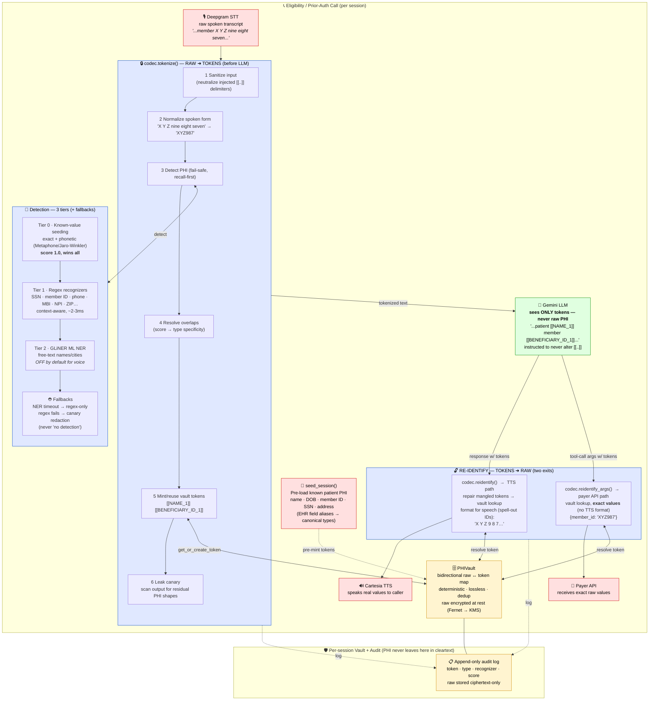

# PHI Protection in the Voice AI Pipeline

How `phi_codec` keeps raw PHI out of the LLM (and logs/transcripts) while still letting the
agent speak real values to the caller and send exact values to the payer API.

## The one-line idea

**Raw PHI is replaced with `[[TYPE_N]]` tokens *before* the LLM, and restored *after* — so the
model, prompt logs, and transcripts only ever contain tokens.** The real values live encrypted in a
per-session vault and are re-inserted at the very last moment: spelled-out for the TTS voice, or exact
for the payer API.

| Stage | Direction | What crosses the boundary |
|-------|-----------|---------------------------|
| `tokenize()`        | raw → tokens | STT text de-identified before Gemini |
| `reidentify()`      | tokens → raw | LLM reply restored + spell-out formatted for TTS |
| `reidentify_args()` | tokens → raw | LLM tool args restored to exact values for payer API |

**Backstops:** recall-first detection (low score floor) + leak canary on the output + fail-closed
re-identify (unknown tokens are never spoken/sent) + detection fallbacks that never degrade to
"no detection."
